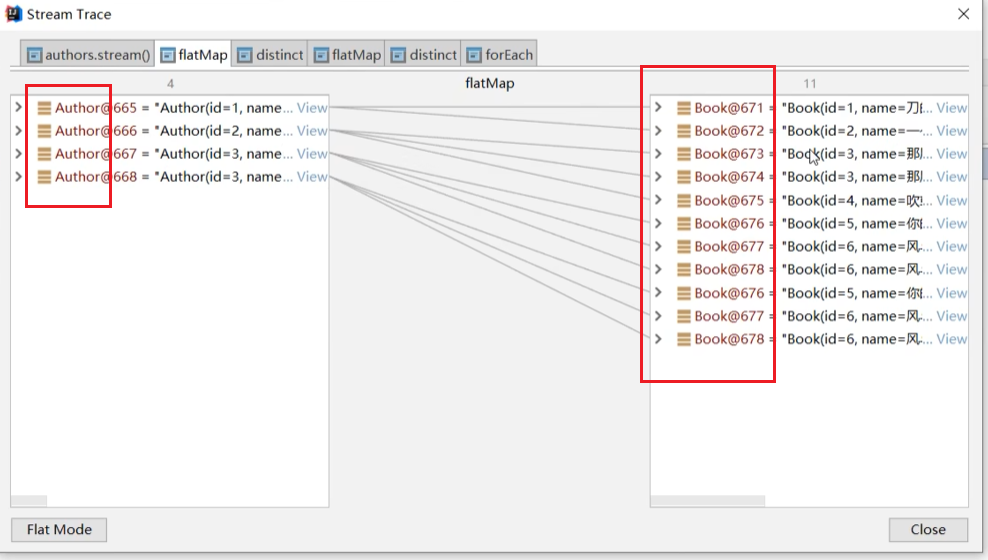

---

---

### 2.Lambda表达式

#### 2.1概述

Lambda是JDK8中一个语法糖。他可以对某当匿名内部类的写法进行简化。它是函数式编程思想的一个重要体现。让我们不用关注是什么对象。而是更关注我们对数据进行了什么操作。

#### 

#### 2.2核心原则

可推导可省略

#### 2.3基本格式

```java
(参数列表)->{代码}
```

例一
我们在创建线程并启动时可以使用匿名内部类的写法：

```java
public static void main(String[] args) {
    new Thread(new Runnable() {
        @Override
        public void run() {
            System.out.println("run方法执行");
        }
    }).start();
}
```

首先new Runnable()接口是一个匿名内部类，并且当中只有一个抽象方法需要重写，就可以转换成lambda表达式。

#### 2.4省略规则

* 参数类型可以省略
* 方法体只有一句代码时大括号return和唯一一句代码的分号可以省略
* 方法只有一个参数时小活号可以省略
* 以上这些规则都记不住也可以省略不记

### 3.Stream流

#### 3.1概述

Java8的Stream使用的是函数式编程模式，如同它的名字一样，它可以被用来对集合或数组进行链状流式的操作。可以更方便的让我们对集合或数组操作。

#### 3.4常用操作

##### 3.4.1创建流

单列集合：集合对象.stream()

```java
List<Author>authors getAuthors();
Stream<Author>stream authors.stream();
```

数组:Arrays.stream(数组)或者使用Stream.of来创建

```java
Integer[]arr = {1,2,3,4,5};
Stream<Integer>stream = Arrays.stream(arr);
Stream<Integer>stream2 = stream.of (arr);
```

双列集合：转换成单列集合后再创建

```java
Map<string,Integer>map = new HashMap<();
map.put("蜡笔小新"，19)；
map.put("黑子"，17)；
map.put("日向用阳"，16)：
Stream<Map.Entry<string,Integer>>stream = map.entrySet().stream();
```

#### 3.4.2中间操作

##### filter

可以对流中的元素进行条件过滤，符合过滤条件的才能继续留在流中。
例如：
打印所有姓名长度大于1的作家的姓名

```java
List<Author>authors = getAuthors();
authors.stream()
.filter (author ->author.getName().length()>1)
.forEach (author ->System.out.println(author.getName()))
```

##### distinct

可以去除流中的重复元素。
例如：
打印所有作家的姓名，并且要求其中不能有重复元素。
I
注意：distinct,方法是依赖object的equals方法来判断是否是相同对象的。所以需要注意重写equals方法。

##### sorted

可以对流中的元素进行排序。
例如：
对流中的元素按照年龄进行降序排序，并且要求不能有重复的元素。

注意：如果调用空参的sorted()方法，需要流中的元素是实现了Comparable。

```java
 List<Author> authors= getAuthors();
        authors.stream().sorted((o1, o2) -> o1.getAge()-o2.getAge()).
                forEach(author -> System.out.println(author.getAge()));
```

注意：如果调用空参的sorted()方法，需要流中的元素是实现了Comparable。

##### limit

可以设置流的最大长度，超出的部分将被抛弃。
例如：
对流中的元素按照年龄进行降序排序，并且要求不能有重复的元素，然后打印其中年龄最大的两个作家的姓名。

```java
private static void extracted3() {
    List<Author> authors = getAuthors();
    authors.stream()
            .distinct()
            .sorted()
            .limit(2)
            .forEach(author -> System.out.println(author.getName()));
}
```

##### flatMap 

map只能把一个对象转换成另一个对象来作为流中的元素。而flatMap可以把一个对象转换成多个对象作为流中的元素。



#### 3.4.3终结操作

##### forEach

对流中的元素进行遍历衡作，我们通过传入的参数去指定对遍历到的元素进行什么具体操作。

##### count

可以用来获取当前流中元素的个数。

##### collect

把当前流转换成个集合。
例子：
获取一个存放所有作者名字的List集合。

##### 查找与匹配

##### anyMatch

可以用来判断是否有任意符合匹配条件的元素，结果为boolean类型。

##### allMatch

可以用来判断是否都符合匹配条件，结果为boolean类型。如果都符合结果为true,否则结果为false。
例子：
判断是否所有的作家都是成年人

##### noneMatch

可以判断流中的元素是否都不符合匹配条件。如果都不符合结果为true,否则结果为false
例子：
判断作家是否都没有超过100岁的。

##### findAny

获取流中的任意一个元素。该方法没有办法保证获取的一定是流中的第一个元素。

##### findFirst

获取流中的第一个元素。

##### reduce归并

对流中的数据按照你制定的计算方式计算出一个结果。
reduce的作用是把stream中的元素给组合起来，我们可以传入一个初始值，它会按照我们的计算方式依次拿流中的元素和在初始化值的基础上进行计算，计算结果再和后面的元素计算。

他内部的计算方式如下：

```java
T result identity;
for (T element this stream)
result = accumulator.apply(result,element)
return result;
```

reduce一个参数的重载形式内部的计算 将第一个元素作为了初始值

```java
boolean foundAny false;
T result = null;
for (T element this stream){
    if (foundAny){
    foundAny true;
    result element;
}
else
result = accumulator.apply(result,element);
}
return foundAny？optional.of(result):Optional.empty();
```

#### 3.5注意事项

* 惰性求值（如果没有终结操作，没有中间操作是不会得到执行的）
*    流是一次性的（一旦一个流对象经过一个终结操作后。这个流就不能再被使用）
* 不会影响原数据（我们在流中可以多数据做很多处理。但是正常情况下是不会影响原来集合中的元素的。这往往也是我们期望的）