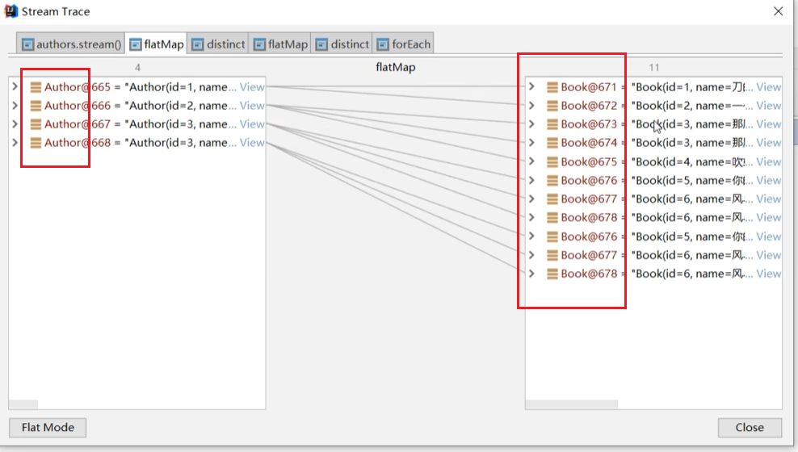
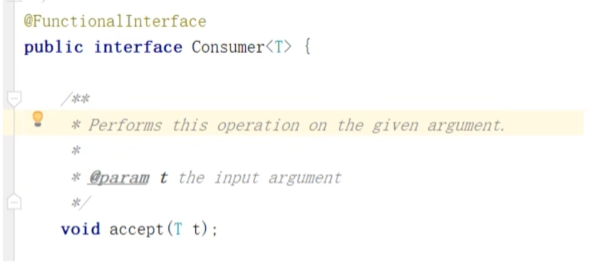
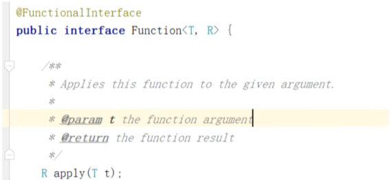
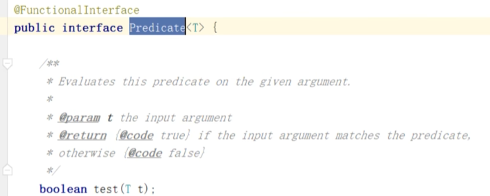
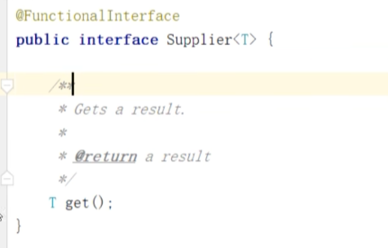
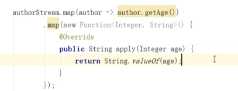
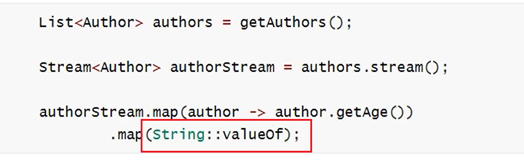

---

---

### 2.Lambda表达式

#### 2.1概述

Lambda是JDK8中一个语法糖。他可以对某当匿名内部类的写法进行简化。它是函数式编程思想的一个重要体现。让我们不用关注是什么对象。而是更关注我们对数据进行了什么操作。

#### 

#### 2.2核心原则

可推导可省略

#### 2.3基本格式

```java
(参数列表)->{代码}
```

例一
我们在创建线程并启动时可以使用匿名内部类的写法：

```java
public static void main(String[] args) {
    new Thread(new Runnable() {
        @Override
        public void run() {
            System.out.println("run方法执行");
        }
    }).start();
}
```

首先new Runnable()接口是一个匿名内部类，并且当中只有一个抽象方法需要重写，就可以转换成lambda表达式。

#### 2.4省略规则

* 参数类型可以省略
* 方法体只有一句代码时大括号return和唯一一句代码的分号可以省略
* 方法只有一个参数时小活号可以省略
* 以上这些规则都记不住也可以省略不记

### 3.Stream流

#### 3.1概述

Java8的Stream使用的是函数式编程模式，如同它的名字一样，它可以被用来对集合或数组进行链状流式的操作。可以更方便的让我们对集合或数组操作。

#### 3.4常用操作

##### 3.4.1创建流

单列集合：集合对象.stream()

```java
List<Author>authors getAuthors();
Stream<Author>stream authors.stream();
```

数组:Arrays.stream(数组)或者使用Stream.of来创建

```java
Integer[]arr = {1,2,3,4,5};
Stream<Integer>stream = Arrays.stream(arr);
Stream<Integer>stream2 = stream.of (arr);
```

双列集合：转换成单列集合后再创建

```java
Map<string,Integer>map = new HashMap<();
map.put("蜡笔小新"，19)；
map.put("黑子"，17)；
map.put("日向用阳"，16)：
Stream<Map.Entry<string,Integer>>stream = map.entrySet().stream();
```

#### 3.4.2中间操作

##### filter

可以对流中的元素进行条件过滤，符合过滤条件的才能继续留在流中。
例如：
打印所有姓名长度大于1的作家的姓名

```java
List<Author>authors = getAuthors();
authors.stream()
.filter (author ->author.getName().length()>1)
.forEach (author ->System.out.println(author.getName()))
```

##### distinct

可以去除流中的重复元素。
例如：
打印所有作家的姓名，并且要求其中不能有重复元素。
I
注意：distinct,方法是依赖object的equals方法来判断是否是相同对象的。所以需要注意重写equals方法。

##### sorted

可以对流中的元素进行排序。
例如：
对流中的元素按照年龄进行降序排序，并且要求不能有重复的元素。

注意：如果调用空参的sorted()方法，需要流中的元素是实现了Comparable。

```java
 List<Author> authors= getAuthors();
        authors.stream().sorted((o1, o2) -> o1.getAge()-o2.getAge()).
                forEach(author -> System.out.println(author.getAge()));
```

注意：如果调用空参的sorted()方法，需要流中的元素是实现了Comparable。

##### limit

可以设置流的最大长度，超出的部分将被抛弃。
例如：
对流中的元素按照年龄进行降序排序，并且要求不能有重复的元素，然后打印其中年龄最大的两个作家的姓名。

```java
private static void extracted3() {
    List<Author> authors = getAuthors();
    authors.stream()
            .distinct()
            .sorted()
            .limit(2)
            .forEach(author -> System.out.println(author.getName()));
}
```

##### flatMap 

map只能把一个对象转换成另一个对象来作为流中的元素。而flatMap可以把一个对象转换成多个对象作为流中的元素。



#### 3.4.3终结操作

##### forEach

对流中的元素进行遍历衡作，我们通过传入的参数去指定对遍历到的元素进行什么具体操作。

##### count

可以用来获取当前流中元素的个数。

##### collect

把当前流转换成个集合。
例子：
获取一个存放所有作者名字的List集合。

##### 查找与匹配

##### anyMatch

可以用来判断是否有任意符合匹配条件的元素，结果为boolean类型。

##### allMatch

可以用来判断是否都符合匹配条件，结果为boolean类型。如果都符合结果为true,否则结果为false。
例子：
判断是否所有的作家都是成年人

##### noneMatch

可以判断流中的元素是否都不符合匹配条件。如果都不符合结果为true,否则结果为false
例子：
判断作家是否都没有超过100岁的。

##### findAny

获取流中的任意一个元素。该方法没有办法保证获取的一定是流中的第一个元素。

##### findFirst

获取流中的第一个元素。

##### reduce归并

对流中的数据按照你制定的计算方式计算出一个结果。
reduce的作用是把stream中的元素给组合起来，我们可以传入一个初始值，它会按照我们的计算方式依次拿流中的元素和在初始化值的基础上进行计算，计算结果再和后面的元素计算。

他内部的计算方式如下：

```java
T result identity;
for (T element this stream)
result = accumulator.apply(result,element)
return result;
```

reduce一个参数的重载形式内部的计算 将第一个元素作为了初始值

```java
boolean foundAny false;
T result = null;
for (T element this stream){
    if (foundAny){
    foundAny true;
    result element;
}
else
result = accumulator.apply(result,element);
}
return foundAny？optional.of(result):Optional.empty();
```

#### 3.5注意事项

* 惰性求值（如果没有终结操作，没有中间操作是不会得到执行的）
* 流是一次性的（一旦一个流对象经过一个终结操作后。这个流就不能再被使用）
* 不会影响原数据（我们在流中可以多数据做很多处理。但是正常情况下是不会影响原来集合中的元素的。这往往也是我们期望的）

### 4.Optional

#### 4.1概述

我们在编写代码的时候出现最多的就是空指针异常。所以在很多情况下我们需要做各种非空的判断。
例如：

```java
Authorauthor = getAuthor();
if (author!=nu11){
System.out.println(author.getName())
}
```

尤其是对象中的属性还是一个对象的情况下。这种判断会更多。
而过多的判断语句会让我们的代码显得臃肿不堪。
所以在到DK8中引入了Optional,养成使用Optional的习惯后你可以写出更优雅的代码来避免空指针异常。
并且在很多函数式编程相关的API中也都用到了Optional,如果不会使用Optional也会对函数式编程的学习造成影响。

#### 4.2使用

##### 4.2.1创建对象

Optional就好像是包装类，可以把我们的具体数据封装Optional对象内部。然后我们去使用Optional中封装好的方法操作封装进去的数据就可以非常优雅的避免空指针异常。
我们一般使用Optional的静态方法ofNullable来把数据封装成一个Optional对象。无论传入的参数是否为null都不会出现问题。

```java
Author author = getAuthor();
Optional<Author>authoroptional = optional.ofNullable(author);
```

你可能会觉得还要加一行代码来封装数据比较麻烦。但是如果改造下getAuthor方法，让其的返回值就是封装好的Optional的话，我们在使用时就会方便很多。
而且在实际开发中我们的数据很多是从数据库获取的。Mybatis从3.5版本可以也已经支持Optional了。我们可以直接把dao方法的返回值类型定义成Optional类型，MyBastis会自己把数据封装成Optional对象返回。封装的过程也不需要我们自己操作。

##### 4.2.2安全消费值

我们获取到一个Optionals对象后肯定需要对其中的数据进行使用。这时候我们可以使用其ifPresent方法对来消费其中的值。这个方法会判断其内封装的数据是否为空，不为空时才会执行具体的消费代码。这样使用起来就更加安全了。
例如，以下写法就优雅的避免了空指针异常。

```java
Optional<Author>authoroptional = optional.ofNullable(getAuthor ())
authoroptional.ifPresent(author ->System.out.println(author.getName()));
```

##### 4.2.3获取值


如果我们想获取值自己进行处理可以使用get方法获取，但是不准荐。因为当Optional内部的数据为空的时候会出现异常。

##### 4.2.4安全获取值

如果我们期望安全的获取值。我们不推荐使用get方法，而是使用Optional提供的以下方法。
·orElseGet
获取数据并且设置数据为空时的默认值。如果数据不为空就能获取到该数据。如果为空则根据你传入的参数来创建对象作为默认值返回。

```java
Optional<Author>authoroptional= optional.ofNullable(getAuthor ());
Author author1 = authoroptional.orElseGet(()->new Author());
```

·orElseThrow
获取数据，如果数据不为空就能获取到该数据。如果为空则根据你传入的参数来创建异常抛出。

```java
Optional<Author>authoroptional = optional.ofNullable(getAuthor ())
try{
	Author author = authoroptional.orglseThrow((Supplier<Throwable>)()->new
	RuntimeException("author为空"))i
	System.out.println(author.getName ())
}
catch (Throwable throwable){
	throwable.printstackTrace();
}
```

##### 4.2.5过滤

我们可以使用filter方法对数据进行过滤。如果原本是有数据的，但是不符合判断，也会变成一个无数据的Optional对象。

```java
Optional<Author>authoroptional = optional.ofNu1lable(getAuthor ());
authoroptional.filter(author ->author.getAge()>100).ifPresent (author ->
System.out.println (author.getName()));
```

##### 4.2.6判断

我们可以使用isPresent方法进行是否存在数据的判断。如果为空返回值为false,如果不为空，返回值为true。但是这种方式并不能体现
Optional的好处，更推荐使用ifPresent方法。

java


```java
Optional<Author>authoroptional = optional.ofNu1lable(getAuthor ());
if (authoroptional.isPresent()){
	System.out.println (authoroptional .get().getName());
}
```

##### 4.2.7数据转换

Optional还提供了map可以让我们的对数据进行转换，并且转换得到的数据也还是被Optional包装好的，保证了我们的使用安全。
例如我们想获取作家的书籍集合。

```java
private static void testMap(){
    Optional<Author>authoroptional = getAuthoroptional();
    optional<List<Book>>optionalBooks = authoroptional.map (author -author.getBooks());
    optionalBooks.ifPresent (books -System.out.println(books));
}	
```

### 5.函数式接口

#### 5.1概述


**只有一个抽象方法**的接口我们称之为函数接口。
JDK的函数式接口都加上了@Functionallnterface注解进行标识。但是无论是否加上该注解只要接口中只有一个抽象方法，都是函数式接口。

#### 5.2常见函数式接口

Consumer消费接口
根据其中抽象方法的参数列表和返回值类型知道，我们可以在方法中对传入的参数进行消费。



Function计算转换接口
根据其中抽象方法的参数列表和返回值类型知道，我们可以在方法中对传入的参数计算或转换，把结果返回



Predicate判斯接口
根据其中抽象方法的参数列表和返回值类型知道，我们可以在方法中对传入的参数条件判断，返回判断结果



Supplier生产型接口
根据其中抽象方法的参数列表和返回值类型知道，我们可以在方法中创建对象，把创建好的对象返回



#### 5.3 常用的默认方法

##### and

我们在使用Predicate接口时候可能需要进行判断条件的拼接。而and方法相当于是使用&&来拼接两个判断条件
例如：
打印作家中年龄大于17并目姓名的长度大于1的作家。

```java
List<Author>authors = getAuthors();
stream<Author>authorstream = authors.stream();
authorstream.filter(new Predicate<Author>()
        @override
        public boolean test(Author author){
        return author.getAge()>17;
    }.and(new Predicate<Author>()
        @override
        public boolean test(Author author){
            return author.getName().length()>1;
        }
    })).forEach(author ->System.out.println(author));
```

##### or

我们在使用Predicate接口时候可能需要进行判断条件的拼接。而or方法相当于是使用|来拼接两个判断条件。
例如：
打印作家中年龄大于17或者姓名的长度小于2的作家。

```java
List<Author>authors = getAuthors();
authors.stream()
.filter(new Predicate<Author>()
    @override
    public boolean test(Author author){
   		 return author.getAge()>17;
    }.or(new Predicate<Author>(){
       		@override
            public boolean test(Author author){
            	return author.getName().length()<2;
            }
        }))forEach(author ->System.out.println(author.getName()))
```

negate
Predicate接口中的方法。negate方法相当于是在判断添加前面加了个！表示取反
例如：
打印作家中年龄不大于17的作家。

```java
List<Author>authors = getAuthors ();
authors .stream(
    .filter (new Predicate<Author>()
        @override
        public boolean test(Author author){
            return author.getAge()>17;
        }
}negate()).forEach (author ->System.out.println(author.getAge()));
```

### 6.方法引用

我们在使用lambda时，如果方法体中只有一个方法的调用的话（包括构造方法），我们可以用方法引用进一步简化代码。

#### 6.1推荐用法

​	我们在使用lambda时不需要考虑什么时候用方法引用，用哪种方法引用，方法引用的格式是什么。我们只需要在写完lambda方法发现方法体只有一行代码，并且是方法的调用时使用快捷键尝试是否能够转换成方法引用即可。
​	当我们方法引用使用的多了慢慢的也可以直接写出方法引用。

#### 6.2基本格式

类名或者对象名：方法名

#### 6.3语法详解（了解）

##### 6.3.1引用类的静态方法

其实就是引用类的静态方法工
**格式**

```
类名：：方法名
```

**使用前提**
如果我们在重写方法的时候，方法体中**只有一行代码**，并且这行代码是**调用了某个类的静态方法**，并且我们把要重写的**抽象方法中所有的参数都按照顺序传入了这个静态方法中**，这个时候我们就可以引用类的静态方法。





##### 6.3.2引用对象的实例方法

**格式**

```
对象名：：方法名
```

**使用前提**
如果我们在重写方法的时候，方法体中只有一行代码，并目这行代码是调用了某个对象的成员方法，并且我们把要重写的***抽象方法中所有的参数都按照顺序传入了这个成员方法中***，这个时候我们就可以引用对象的实例方法

例如：

```java
List<Author>authors = getAuthors ();
stream<Author>authorstream = authors.stream();
StringBuilder sb = new StringBuilder();
authorstream.map (author ->author.getName())
.forEach (name->sb.append(name));
```

优化后：

```java
List<Author>authors = getAuthors ();
stream<Author>authorstream = authors.stream();
StringBuilder sb = new StringBuilder();
authorstream.map (author ->author.getName()
.forEach(sb::append);
```

##### 6.3.4引用类的实例方法

**格式** 

```
类名：：方法名
```


使用前提
如果我们在重写方法的时候，方法体中只有一行代码，并且这行代码是**调用了第一个参数的成员方法**，并目我们把要**重写的抽象方法中剩余的所有的参数都按照顺序传入了这个成员方法中**，这个时候我们就可以引用类的实例方法。

```java
interface Usestring{
	string use(string str,int start,int length);
}
public static string subAuthorName(string str,Usestring usestring){
    int = start 0;
    int = length 1;
    return usestring.use(str,start,length);
}
public static void main(string[]args){
    subAuthorName("三更草堂"，new Usestring(O(
    @override
        public string use(string str,int start,int length){
        return str.substring(start,length);
        }
    });
}
```

优化过后如下：

```java
public static void main(String[] args){
	subAuthorName("三更草"，str1ng::substring):
}
```

